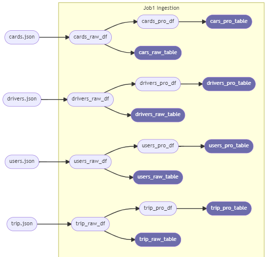
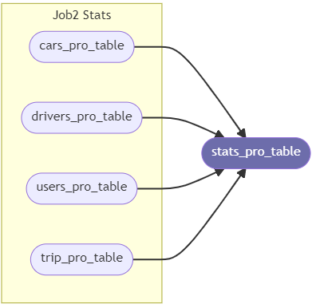
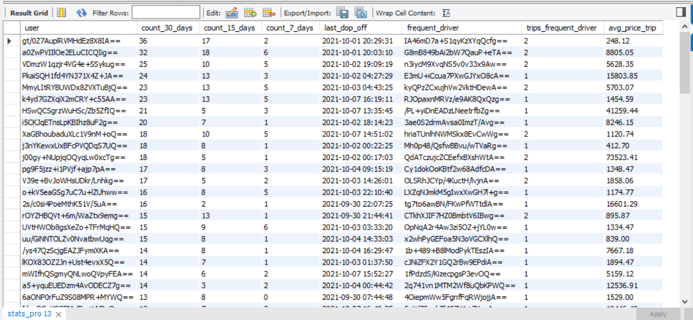

# Data Engineering Data Warehouse Code Challenge
These are the instructions and comments for the proposed solution.

- Install the necessary dependencies executing: pip install **-r requeriments.txt**
- You must have installed Mysql and Spark on tour system.
- Create a Virtual Environment: create an python3 **-m venv <venv_name>**
- Activate your venv: source **<venv_name>/bin/activate**

As relational databases **MySQL Community Edition** was selected for this challenge. Firstly it's necessary to create two databases 
with the following commands:

- **cabify_raw_db**: CREATE DATABASE IF NOT EXISTS cabify_raw_db;
- **cabify_pro_db**: CREATE DATABASE IF NOT EXISTS cabify_pro_db;

- The database **cabify_raw_db** will be the database to store the raw data.
- The database **cabify_pro_db** will be the database to store pro data (data without duplicates).

As first approach, the solution have 2 jobs that can be executed independently:
- **Job1 - Ingestion**: This job carried out the data ingestion into the first layer of MySQL database (**cabify_raw_db**)
for the raw data and the ingestion of the pro data into another MySQL database (**cabify_pro_db**). The phases are:
 
        -1. Read json input files and creates raw dataframes.
        -2. Create Pro dataframes removing duplicates.
        -3. Create raw_tables and insert raw dataframes into cabify_raw_db.
        -4. Create pro_tables and insert pro dataframes into cabify_pro_db.
        
    The **Job1** dataflow follows the next diagram:

    
 
    This first job use Python running over Spark to improve the performance taking the advantage of multi parallel 
    processing tasks offers by Spark considering huge data volumes in real scenarios.

    **Raw dataframes** are inserted directly into **cabify_raw_db** using "mysql-connector-java-8.0.28.jar" selecting 
    append mode due to store all the raw data in each cycle.

    **Pro dataframes** are inserted into **cabiby_pro_db** using "mysql-python-connector". In this case the data will be inserted
    using a replace mode in order to have most recent values in all cabiby_pro_db  tables.

- **Job2 - Stats**: This job generates the statistics table with the requested problem aggregations plus some more. 
The phases of this job are:

        -1. Reads pro tables from cabify_pro_db.
        -2. Exceutes the corresponding aggregations queries
        -3. Inserts or replaces generated values into stars_pro_table.
        
    The Job2 dataflow follows the next diagram:
    
        
    Stats table contains the following aggregations by user:

    - **user**: user identifier.
    - **count_30_days**: count drop off trips in last 30 days.
    - **count_15_days**: count drop off trips in last 15 days.
    - **count_7_days**: count drop off trips in last 7 days.
    - **last_dop_off**: last drop off trip date.
    - **frequent_driver**: most frequent driver.
    - **trips_frequent_driver**: number of drop off trips with most frequent driver.
    - **avg_price_trip**: average price per drop off trip.
 
## Scripts Execution:
1. **Job1**: execute the script src/main/ingestion/run_ingestion.py
2. **Job2**: execute the script src/main/ingestion/run_stats_producer.py

## Output stats table:
The **stats_pro** table generated after the full processes executions is included in this project. Just have a look of
**stats_output.xlsx** file.

The following picture shows stats_pro table generated locally:

## Further considerations:
Depending of the data volumes must be considered in the close future the next things among others:
  - Partitioned tables to improve query performances.
  - Partitions remover jobs according to desired depth of the tables.
  - Improve error and exception handling.
  - Improve logs traces.

